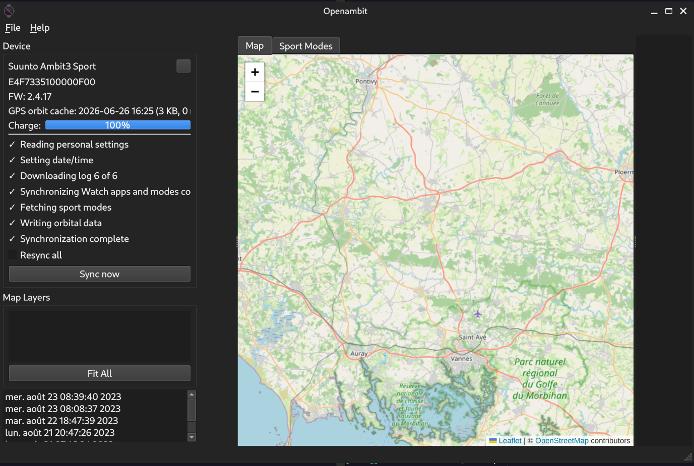
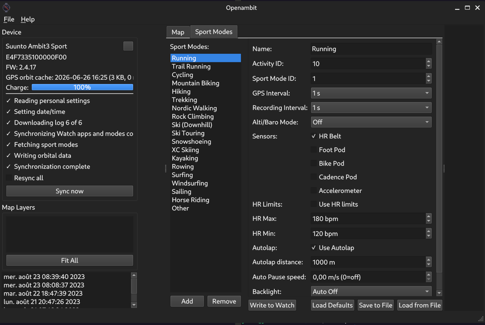

# OpenAmbit

**Free, open-source desktop companion for Suunto Ambit GPS watches.**

OpenAmbit lets you take full ownership of your training data — no cloud account required, no dead service dependency. Sync your watch, explore your tracks on an interactive map, and configure sport modes directly from your desktop.

> Suunto discontinued **Movescount** in 2024. OpenAmbit now works fully offline, using open data sources for GPS orbit updates (IGS / Geoscience Australia).

---

## Screenshots

### Main window — live OSM map with track layers



*Left sidebar shows device status, charge level, sync progress and the log list. The central panel displays an interactive OpenStreetMap with your GPS tracks. Switch to the **Sport Modes** tab at any time without losing your map state.*

### Sport mode editor — read, edit, write to watch



*19 pre-configured outdoor activities (Running, Trail Running, Cycling, Mountain Biking, Hiking, Trekking, Kayaking, Surfing, Windsurfing, Sailing, Horse Riding, Ski, XC Skiing …). Select any mode, tune GPS interval, recording interval, HR belt, pod sensors, autolap and more, then click **Write to Watch**.*

---

## Features

| Feature | Details |
|---|---|
| **Watch sync** | Reads exercise logs, personal settings, battery charge |
| **Interactive map** | OpenStreetMap via Leaflet — auto-centres on your home area |
| **GeoJSON export** | Tracks → LineString, waypoints → Point FeatureCollection |
| **Layer tree** | Show / hide each track layer independently |
| **Sport mode editor** | 19 outdoor presets; full read / write to watch |
| **GPS orbit update** | Automatic refresh via open IGS/Geoscience Australia source (no account needed) |
| **Dark / light mode** | Follows your GNOME color-scheme setting automatically |
| **Offline-first** | Everything works without any Suunto cloud service |

---

## Supported watches

All **Suunto Ambit**, **Ambit2** and **Ambit3** variants (Sport, Run, Peak, Vertical, Surf).  
Check `src/libambit/device_support.c` for the full device table.

---

## Quick install (Debian / Ubuntu)

Pre-built `.deb` packages are produced by `build-deb.sh`.  
If you have them already:

```bash
sudo dpkg -i libambit0_0.5-1_amd64.deb openambit_0.5-1_amd64.deb
sudo apt-get install -f          # pull in any missing dependencies
```

The udev rule is installed automatically. Plug in your watch — OpenAmbit detects it instantly.

See [INSTALL.md](INSTALL.md) for full build-from-source instructions.

---

## GPS orbit update (no Movescount needed)

OpenAmbit uses the free **IGS / Geoscience Australia** broadcast ephemeris feed.  
On first launch (and whenever the cache is older than 24 hours) it runs the bundled
`tools/rinex2ubx_ambit.py` script in the background and uploads fresh orbit data to the
watch automatically. No account, no login, no cloud service required.

You can also trigger a manual download from **Settings → GPS Orbit**.

---

## Project structure

```
src/libambit/          USB HID communication library (C)
src/movescount/        Data model, log store, XML/JSON parsers (C++)
src/openambit/         Qt5 GUI application (C++)
src/openambit-cli/     Command-line sync tool
src/openambit-routes/  Route upload tool
tools/                 rinex2ubx_ambit.py, openambit2gpx.py, strava uploader
debian/                Debian packaging metadata
```

---

## License

GPLv3 — see `src/openambit/COPYING` and `src/libambit/COPYING`.

---

## Acknowledgements

Original project: <https://github.com/openambitproject/openambit>  
GPS orbit converter: `tools/rinex2ubx_ambit.py` uses the open IGS RINEX 3 broadcast ephemeris.  
Map tiles: © [OpenStreetMap](https://www.openstreetmap.org/copyright) contributors.
